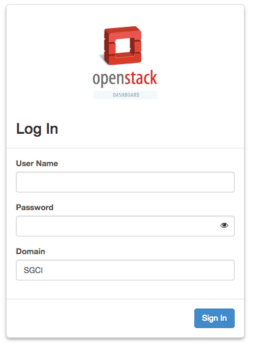
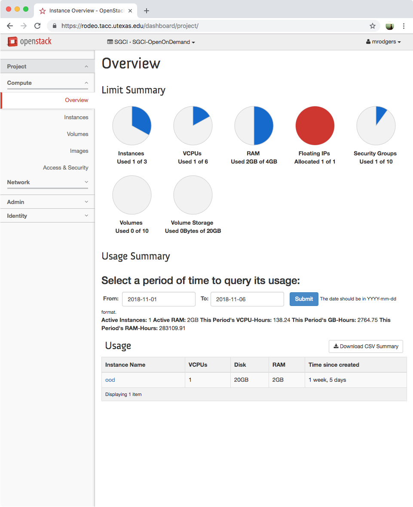
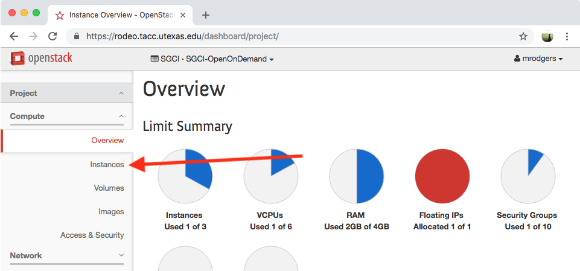
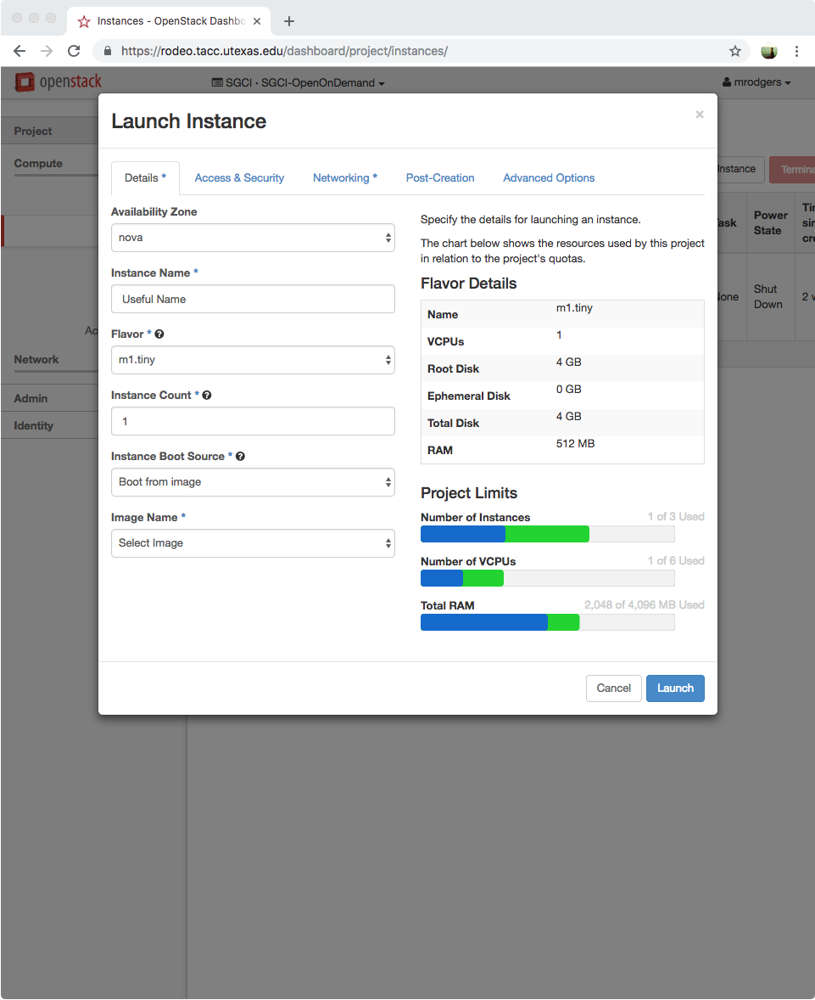
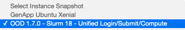
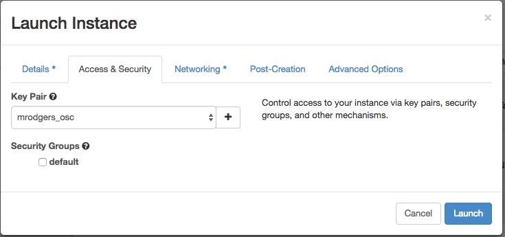
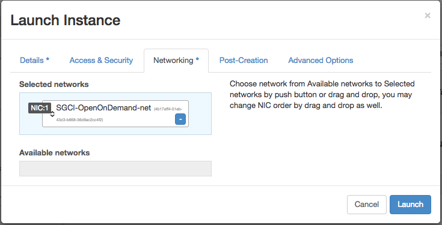
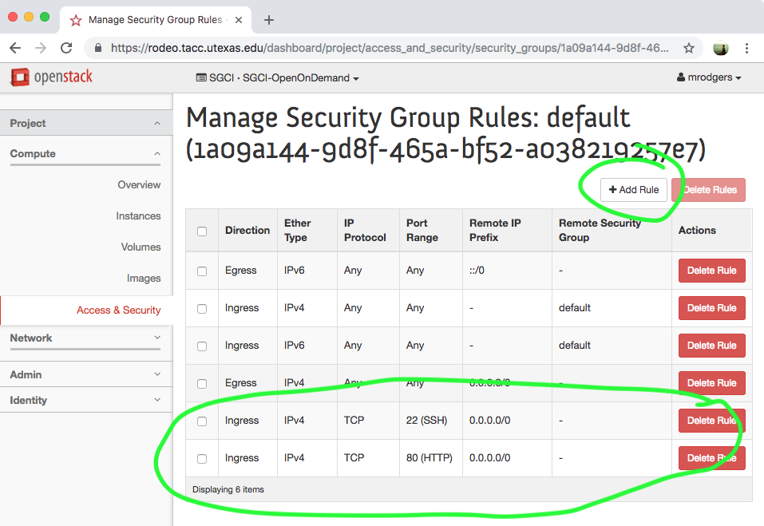

## 1. Requesting SGCI Hosting Services 

Our hosting service provides a limited amount of space on the Rodeo system at the [Texas Advanced Computing Center (TACC)](https://www.tacc.utexas.edu/home). It is available free of charge to US-based gateway projects for up to 6 months of time. 

[Rodeo](https://www.tacc.utexas.edu/systems/rodeo) is a powerful cloud resource that allows for the full customization of computational environments and lets users create virtual machines, host data, and provide services of benefit to the science gateway community. 

Each project approved for hosting time via SGCI will be given a quota of 3 VMs with each VM consisting of 2 VCPUs, 20 GB of Disk, and 4 GB of RAM in addition to a single public, floating IP with your own private project network. Additional configurations are available upon request. A basic security group allowing traffic on the standard web ports (80 and 443) will be provided with additional configurations available upon request. Additional storage is available (either in the form of volumes or larger instances) upon request. 

The Rodeo environment is meant as a test/sandbox environment and does not have any backup capabilities. Please ensure you have backed up any code and services you deploy on the system. Also, the system may be unavailable at times due to maintenance periods. Interested? [Apply using the form on the SGCI Web Site](https://sciencegateways.org/resources/hosting#apply)

## 2. Setting Up Account & VMs on Rodeo 2.1 Creating a SGCI Account 

In order to access Rodeo, you will need to create an account at: 

https://sgci.agaveapi.co/create_account 

IMPORTANT: Please remember your account credentials from this step and please keep your credentials secure. No administrator will ever ask you for your credentials. 

## 2.2 Setup of OpenStack Domain 

Navigate to https://rodeo.tacc.utexas.edu enter your username and password that you used in Creating a SGCI Account. Enter “SGCI” for the Domain field.

## 2.2.1 Navigating the Dashboard
Upon successful login, you will be presented with your project’s dashboard. This view provides a high-level overview of your allocation on Rodeo.

## Creating the Instance
In order to create the instance you will need to navigate to the Instance under the Compute menu.

From the Instances page, click the Launch Instance button.
You will be presented with the Launch Instance wizard which will require filling out few form fields. When launching an instance select “m1.small” from Flavor, “Boot from image” from Instance Boot Source, and “Centos 7” from Image Name.

After populating the Details tab, click the **Access & Security** tab.

Select the Open Ondemand image:

If you already have an SSH key pair, you can import them by clicking the plus (+) button next to the drop-down menu for **Key Pair**. You can also receive instructions on how to generate a key pair if you do not have one already. The wizard will walk you through how to generate a key pair if you need one. This allows you to access your instance. Password login to the admin account is disabled for security purposes.

Once you have configured your Key Pair, you will add your instance to the “default” security group by checking the box under Security Groups.

Once the Access & Security information has been collected move to the next tab labeled Networking to confirm the networking settings.

There should be only one Available Network. Your instance should be associated with the SGCI: Sample Hosting Project Network.
Once the network has been associated you can click the blue “Launch” button. Your instance will be created and available shortly for access.

## 2.2.3 Configuring the Firewall (Security Group)
The default security group allows internal traffic. You may need to create rules to allow SSH, HTTP, and HTTPS to your Hub. You can accomplish by going to the Access & Security menu under Compute.

You will see the default security group listed. Click Manage Rules to review the security group’s policies. The default security group should look similar to this allowing SSH and HTTP access. If you do not see the appropriate entries you can create the by clicking Add Rule.

## 3. Using Open OnDemand

The image you have loaded is a base installation of Open OnDemand version 1.7.0, with a Slurm 18.08.3 on a CentOS 7 base, using HTTP BasicAuth on a unified web/submit/compute node. As this is a demonstration installation of Open OnDemand it does not include non-core apps such as Jupyter notebook integration, a more complete/complex cluster set up with multiple compute nodes, authentication systems such as KeyCloak, or TLS certificates.

You should be able to access it using a web browser on your public IP address. A demo user has been created with the name `ood` and identified with the password `ood`.